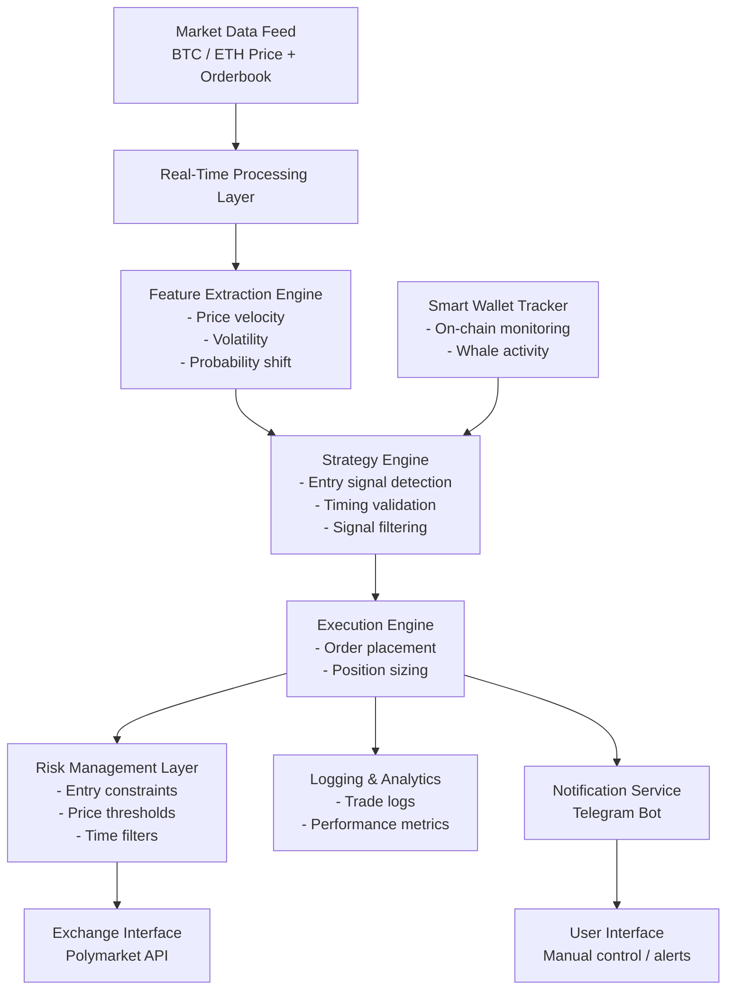
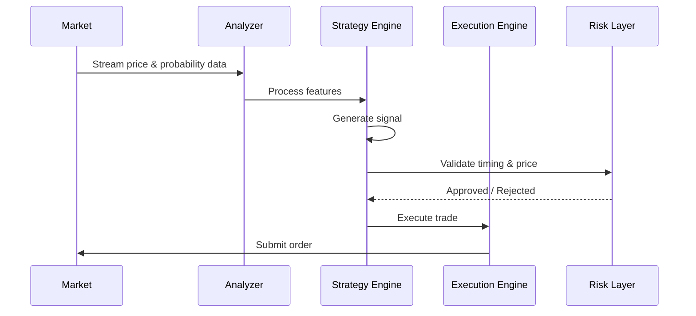

# 🚀 Polymarket 5-Min Trading Bot (BTC & ETH)

> High-frequency prediction market trading system for BTC & ETH 5-minute markets
> Designed for low-latency execution, signal precision, and scalable automation

---

## 🧠 Overview

This system is a **production-oriented automated trading framework** for short-duration prediction markets.

It focuses on:

* BTC & ETH 5-minute directional markets
* Real-time signal processing
* Smart wallet activity tracking
* Execution timing optimization

---

## 🏗️ System Architecture

---

## ⚙️ Core Components

### Market Data Layer

* Aggregates BTC & ETH price feeds
* Tracks probability pricing in real-time

---

### Feature Extraction Engine

* Computes microstructure signals:

  * Price velocity
  * Momentum shifts
  * Short-term volatility

---

### Strategy Engine

* Detects early directional bias
* Applies timing constraints
* Filters low-confidence signals

---

### Smart Wallet Module (Optional)

* Monitors high-performing wallets
* Identifies large position entries
* Integrates signals into decision layer

---

### Execution Engine

* Handles order placement
* Optimizes position sizing
* Ensures minimal latency

---

### Risk Management Layer

* Prevents late entries
* Applies price deviation thresholds
* Enforces time-based constraints

---

### Notification & Control Layer

* Telegram-based interaction
* Real-time trade alerts
* Manual override capability

---

## 🧩 Strategy Flow

---

## 💡 Key Edge

The system is based on:

* Timing optimization rather than indicator lag
* Early signal detection before price adjustment
* Structured filtering to avoid late-entry scenarios

---

## ⚠️ Market Characteristics

5-minute prediction markets exhibit:

* High volatility
* Rapid probability repricing
* Strong competition from automated systems

This architecture is designed specifically to operate under these constraints.

---

## 🔐 Access Model

This repository provides:

* System architecture
* Strategy framework
* Integration design

Core execution logic and proprietary modules are not publicly included.

---

## 🤝 Collaboration

For:

* Custom strategy development
* Private bot access
* Integration into existing systems

Contact via Telegram:

**@Kat_logic**

---

## 🧠 Closing Note

If you find this framework useful or it helped shape your understanding:

> Consider supporting the project — it helps continue development and refinement.

---

**This is not a generic bot.
It is a modular trading system designed for precision and control.**
